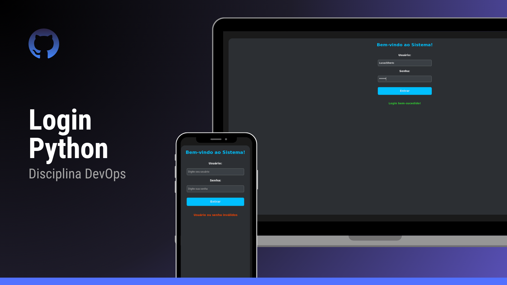

<h1 align="center"> Tela de Login - Python </h1>

  <a href="#-tecnologias">Tecnologias</a>&nbsp;&nbsp;&nbsp;|&nbsp;&nbsp;&nbsp;
  <a href="#-projeto">Projeto</a>&nbsp;&nbsp;&nbsp;|&nbsp;&nbsp;&nbsp;
  <a href="#-layout">Layout</a>&nbsp;&nbsp;&nbsp;|&nbsp;&nbsp;&nbsp;
  <a href="#-licença">Licença</a>

  

 

  

## 🚀 Tecnologias

Esse projeto foi desenvolvido com as seguintes tecnologias:

- Python
- Tkinter
- Git e GitHub
- Docker
- GitHub Actions (CI/CD)

## 💻 Projeto

Esse projeto é uma tela de login desenvolvida em Python. Ele realiza verificações simples de credenciais, e serve como base para o aprendizado de práticas DevOps como:

- Integração contínua (CI)
- Entrega contínua (CD)
- Criação e uso de Dockerfiles
- Organização de repositórios no GitHub

## 🎨 Layout

O layout consiste em uma interface gráfica com campos de usuário e senha, validando se os dados inseridos são válidos para acesso ao sistema.

## 📝 Licença

Esse projeto está sob a licença MIT.

---

Feito com 💻 por [Lucas Silverio](https://github.com/SilverioeSantos)
